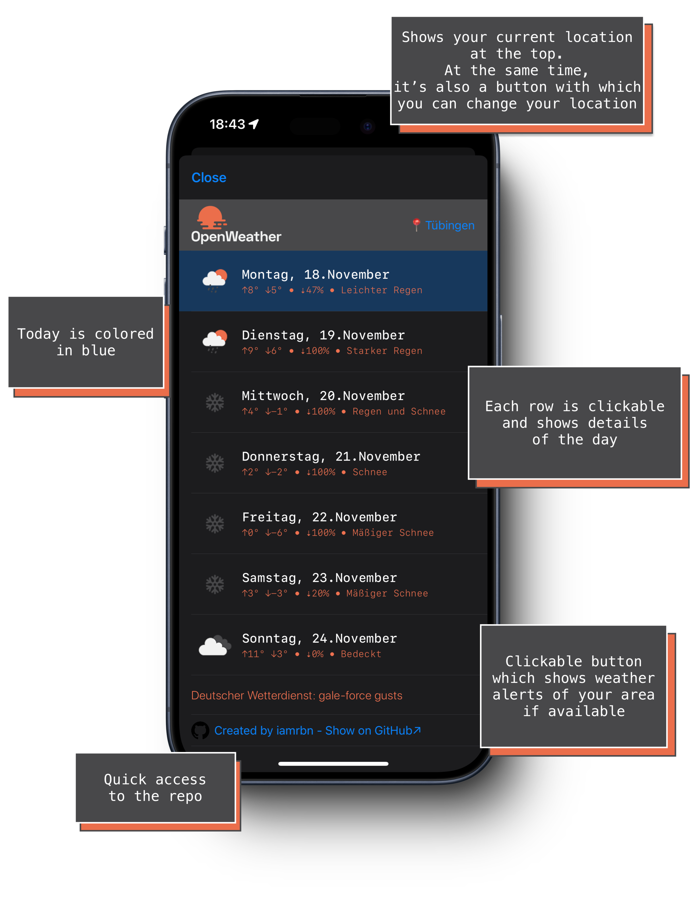

#  Inline-Weather


Script which shows weather datas from the openweathermap-api in [Scriptable for iOS](https://scriptable.app/ "App Homepage") in the lockscreen-widgets.

<a href="https://home.openweathermap.org/users/sign_up">
	
</a>

First of all, you need an API-key by OpenWeather out of your [account](https://home.openweathermap.org/api_keys "https://home.openweathermap.org/api_keys"). If you doesn't have an accountone, click [here](https://home.openweathermap.org/users/sign_up "https://home.openweathermap.org/users/sign_up") to sign up.

#### ATTENTION!
The current script version (`1.1`) uses now the API v3.0 endpoint.
Because openweathermap is shutting down version 2.5 on Oct. 14.


## Features
#### Available Widget Sizes (Lockscreen)
- Inline (current weather)
- Circular (current weather)
- Rectangular (current & forecast)


### Tabel View (In App)
- Current & Forecast
- Clickable rows
- Detailview of each day
- Dialog, that shows the city ID
- Quick access to this GitHub Repo in the footer



#### Detailed iew of a specific day:


#### Change your location:


#### Weather alerts in your area:


## Config

#### Widget Parameter
Default value if null: `30;current`
The number at the beginning means the refresh intervall of the widget.
The second value controls which datas will be shown (current or forecast)

#### Script Parameter
``` Javascript
const unit = 'metric' //Units of measurement: 'standard', 'metric' and 'imperial' units are available.
const unitSymb = '°' //Celsius
const unitSpeed = 'km/h'
const language = 'de' //learn more: https://openweathermap.org/current#multi
const standardParameter = '30;current'
```

#### Your API-Key
The script asks you at the first run for your openweathermap API-Key.
It saves it in the 'Inline Weather' Directory at the Scriptable iCloud Folder as JSON file.
So it wont go lost after script updates.     


___

### Info Widget
The info widgets show existing errors. For example, if there is no internet connection or the API key is incorrect.


### Selfupdate Function
The Script updates itself[^1]

### On the first run
It downloads a module from this github repo and saves it in the "Inline Weather" directory.
```
iCloud Drive/
├─ Scriptable/
│  ├─ Inline Weather/
│  │  ├─ module.js
------------------
│  │  ├─ apiKey.json <-- your successfully saved API-Key
```


---

<p align="center">
  <a href="https://reddit.com/user/iamrbn/">
    
  </a>
  <a href="https://twitter.com/iamrbn_/">
    
  </a>
  <a href="https://mastodon.social/@iamrbn">
    
  </a>
</p>

<br>

[^1]:[Function](https://github.com/mvan231/Scriptable#updater-mechanism-code-example "GitHub Repo") is written by the amazing [@mvan231](https://twitter.com/mvan231 "Twitter")
